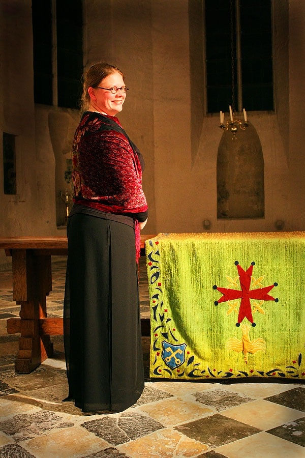

---
---

### Marsja Mudde Muziek: experienced in giving experience ###

Experienced in giving experience is the motto of Marsja Mudde Muziek and what Marsja stands for as a person and musician. According to her, making music is really an experience profession. As a musician you are trained based on what the teacher experiences while listening to you. And through a lot of repetition and practice with the teacher's feedback, or after a lot of experience, you master the subject.

Graduation is not the end of gaining experience. Time and time again, learning and experiencing remain paramount, for example when researching and practicing new repertoire.

Experience also helps to become better at teaching. Getting better at listening to the student, hearing what is going well and what isn't going well, and guiding the student to learn through experience.

Performing music can also be described as letting the audience experience what the repertoire does to the musician and to them. And in the contact with the audience and with the content and experience intended by the text author and the composer, it is in that contact that Marsja experiences the greatest professional joy!

