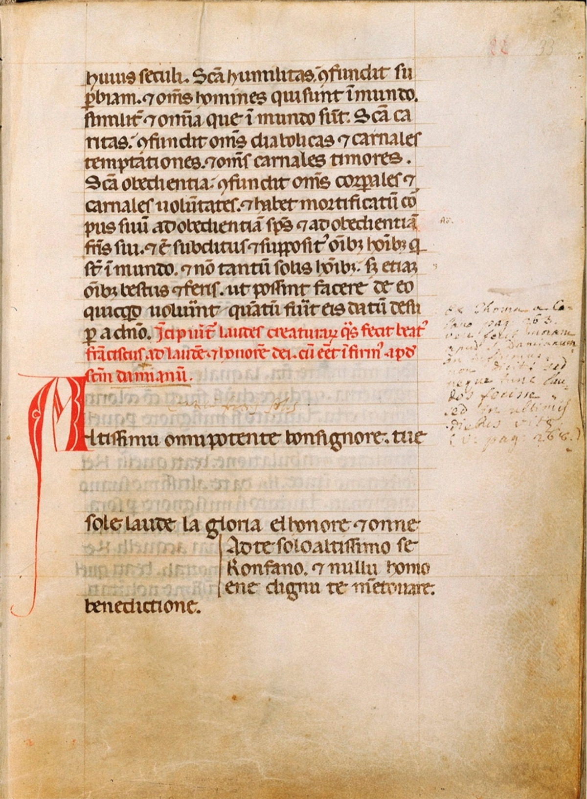

### Sia laudato, San Francesco

Stel je voor: een middeleeuwse troubadour, een straatprediker en een devotionele broederschap en zusterschap om hem heen, allen met een lied op de lippen. Hoe klonk Franciscus’ tijd? 

In het geanimeerde concertprogramma Sia laudato, San Francesco weeft Anime Beatitudinis Cantando een verhalend muzikaal tapijt. Eeuwenoude muzikale parels, kleurrijke afbeeldingen en een flinke dosis vreugde vormen de draden van schering en inslag. Het programma, dat het 800-jarig jubileum van het Zonnelied viert, is ontwikkeld in samenwerking met animator Cristina Garcia Martin.

### Jubel jubileum
Het jaar 2025 is door wijlen paus Franciscus uitgeroepen tot jubeljaar, waarin er extra aandacht is voor de Christelijke pelgrimage naar Rome. Maar dat niet alleen, het is ook het jaar waarin het precies 800 jaar geleden is dat Sint Franciscus (Assisi, 1181 of 1182 – 3 oktober 1226), de patroonheilige van Italie, de dieren en de milieubeweging, zijn beroemde Zonnelied schreef. En in 2026 is het dus het 800-jarig herdenkingsjaar van Franciscus zelf. Dit Zonnelied spreekt verschillende onderdelen van de Schepping aan als broeder of zuster. Achtereenvolgens worden de zon, maan en sterren genoemd, daarna de vier elementen die in de middeleeuwen werden gezien als de basis waaruit de vergankelijke werkelijkheid opgebouwd was: lucht, water, vuur en aarde. Daaraan voegt Franciscus de liefde en de vrede toe. Tegen het einde van zijn leven gaf hij ziekte, de lichamelijke dood en het eeuwige leven tenslotte nog een plek in zijn tekst over de Schepping. Wist hij die elementen uiteindelijk ook te waarderen in hun dienstbaarheid aan de Allerhoogste?

### Een weefsel van verwante muziekstijlen
De afbeelding hiernaast toont de tekst ervan in een dertiende-eeuws handschrift. Uit de opmaak van de pagina kan men afleiden dat de muzieknotatie ontbreekt. Het is een aanwijzing dat het Zonnelied toen al niet alleen werd gebeden, maar ook gezongen. De rol van muziek in het geloof was bij franciscanen heel groot. Thomas van Celano omschrijft hoe Franciscus zong over God als een troubadour over de hoofse liefde. Hij zou regelmatig spontaan in gezang zijn uitgebarsten. Franciscaanse broeders gebruikten vaak muziek en zang bij hun devotie en hun prediking op straat. Men vermoedt dat een deel van deze devotionele liederen, die vaak melodieen leenden van bekende muziek uit die tijd, decennia later nog steeds zijn gebruikt door de devotionele broederschappen in Florence en Cortona, en uiteindelijk genoteerd zijn in zogenaamde laudario’s. Weer later zijn van enkele lauda’s meerstemmige versies ontstaan, opgeschreven in de vaak prachtig verluchte handschriften van de Trecento, zoals de Squarcialupi Codex. En vervolgens werden op die meerstemmige versies soms weer nieuwe wereldlijke teksten bedacht. Zo ontstond een weefsel van aan elkaar verwante stijlen en liederen, van gregoriaanse en troubadours-melodieen tot aan de vroege polyfonie van beroemde Italiaanse Trecento-componisten zoals Francesco (!) Landini en Johannes Ciconia. 

### Ode aan Franciscus en zijn Zonnelied
Uit het brede repertoire van aan elkaar verwante liederen kozen de zangeressen van Anime Beatitudinis Cantando stukken over Franciscus en thema’s die op een andere manier verbonden zijn met zijn leven en gedachtengoed, met de Franciscanen, of met het Zonnelied. Op de Umbrische tekst van het Zonnelied zingen zij ook een melodie in de stijl van muziek uit Franciscus’ tijd. 

### Samenwerking met animator Cristina Garcia Martin
Voor dit programma werkt ensemble ABC voor het eerst samen met animator Cristina Garcia Martin. Geinspireerd op de fresco's die Giotto maakte in de kerk die in Assisi op het graf van Sint Franciscus is gebouwd, maakt zij prachtige moderne animaties bij het Zonnelied en de levensloop van Franciscus die de rode draad vormen in het concert.



Het Zonnelied, gezongen door Anime Beatitudinis Cantando, met de animaties van Cristina Garcia Martin en de Nederlandse vertaling in beeld.

### Sia laudato, San Francesco in het kort
Geanimeerd concertprogramma door vocaal ensemble Anime Beatitudinis Cantando, eventueel aangevuld met andere zangeressen of bespelers van instrumenten. 

Middeleeuwse liederen voor (en door) de heilige Franciscus, waaronder het beroemde Zonnelied, beide jubilerend in de jaren 2025-2026. Boekbaar tot eind december 2026.

Multizintuigelijke beleving dankzij de unieke animatie door Cristina Garcia Martin.

Duur van het programma: minimaal 35 (b.v. in een festival of in een dubbelconcert), maximaal 70 minuten.

Kostenindicatie: neem contact op met [Marsja](mailto:info@marsjamudde.nl) 

Nevenactiviteiten (zoals workshop of lezing) in overleg.

### Speeldata
- Eind februari 2027: nieuwe uitvoeringen
- Vrijdag 2 oktober 2026, 20:00 uur: [Hillegondakerk, Rotterdam](/events/02okt2026-sialaudato/)
- Zaterdag 3 oktober 2026, 20:00 uur: [Remonstrantse kerk, Alkmaar](/events/03okt2026-sialaudato/) — de sterfdag van Franciscus, precies 800 jaar na zijn dood

Wilt u het programma ook bij u laten klinken? Neem contact op voor beschikbaarheid.

Het volledige programma van gezongen stukken staat op de website van het ensemble: [ensembleabc.nl/sia-laudato](https://ensembleabc.nl/sia-laudato/)